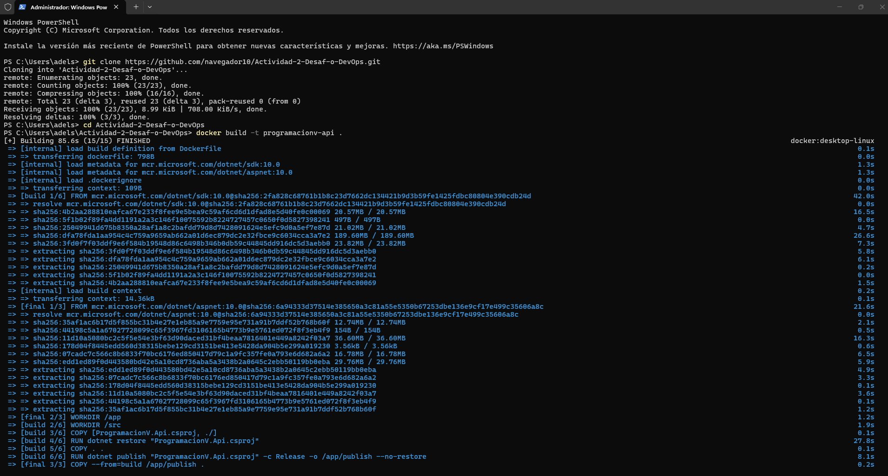
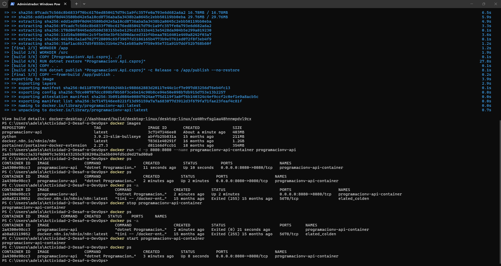
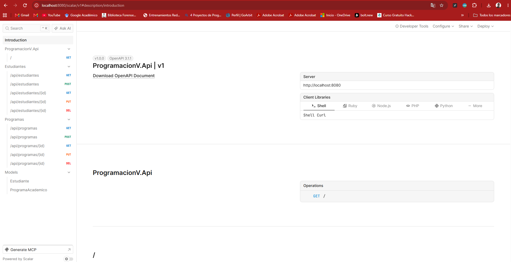

# Actividad 2. Desafío DevOps: de la API al despliegue

**Estudiante:** Adelson Aguirre Rodríguez

**API base:** `ProgramacionV.Api` — la misma API de gestión académica trabajada en el Laboratorio 0 y usada en la Actividad 1.

---

## Trazabilidad con Git (historial de ramas, investigación, recuperación y deshacer un commit)

Aunque el PDF de esta actividad no lo pide explícitamente, la plataforma exige también demostrar el manejo de Git aplicado sobre este mismo trabajo de DevOps. A continuación esa evidencia.

### Construcción del historial de ramas

**Comandos ejecutados, en orden:**

```bash
git commit -m "Estructura base de la API de gestion academica (Laboratorio 0)"  # C1 en main

git switch -c feature/dockerizacion          # desde main
git commit -m "Agrega Dockerfile y .dockerignore para contenerizar la API"       # C2

git switch -c feature/ci-cd                  # desde feature/dockerizacion
git commit -m "Agrega workflow de CI con GitHub Actions (restore + build)"       # C3

git switch main
git merge feature/dockerizacion --no-ff -m "Integra feature/dockerizacion a main"
git merge feature/ci-cd --no-ff -m "Integra feature/ci-cd a main"
```

**Resultado del comando de visualización del árbol (`git log --all --graph --oneline --decorate`):**

```
*   da91e8d (HEAD -> main) Integra feature/ajuste-ci a main
|\
| * 7f032ca (feature/ajuste-ci) Agrega paso de verificacion final al workflow de CI
|/
*   0b8c922 Integra feature/ci-cd a main
|\
| * 302020e (feature/ci-cd) Agrega workflow de CI con GitHub Actions (restore + build)
* | b84e3da Integra feature/dockerizacion a main
|\|
| * 26d4362 (feature/dockerizacion) Agrega Dockerfile y .dockerignore para contenerizar la API
|/
* bf3fb26 Estructura base de la API de gestion academica (Laboratorio 0)
```

**Hash corto de cada commit y rama:**

| Commit | Hash corto | Rama |
|---|---|---|
| C1 | `bf3fb26` | `main` |
| C2 | `26d4362` | `feature/dockerizacion` |
| C3 | `302020e` | `feature/ci-cd` |

**¿Por qué `feature/ci-cd` se origina desde `feature/dockerizacion` y no directamente desde `main`?**

El workflow de CI ejecuta `dotnet restore` y `dotnet build` para validar la aplicación antes de publicar cambios; conceptualmente forma parte del mismo esfuerzo de preparar la entrega automatizada que arrancó con la contenerización. Ramificar desde `feature/dockerizacion` mantiene junto en el historial el trabajo relacionado con la construcción/validación automatizada, antes de integrarlo a `main`.

### Investigación y trazabilidad mediante Git

**Comando utilizado:**
```bash
git show 26d4362 --stat
```
**Resultado obtenido:**
```
commit 26d43628bc6a46d7a424b78a390db8d98a0c170f
Author: Adelson Aguirre Rodríguez <adelson.aguirre@gmail.com>
Date:   Sat Sep 19 20:52:11 2026 +0000

    Agrega Dockerfile y .dockerignore para contenerizar la API

 .dockerignore |  9 +++++++++
 Dockerfile    | 22 ++++++++++++++++++++++
 2 files changed, 31 insertions(+)
```
**Respuesta:** el commit `26d4362` agregó el `Dockerfile` y `.dockerignore`, autor Adelson Aguirre Rodríguez, el 19 de septiembre de 2026.

**Comando utilizado:**
```bash
git show --name-only 302020e
```
**Resultado obtenido:**
```
.github/workflows/build.yml
```
**Respuesta:** el commit `302020e` (rama `feature/ci-cd`) agregó exclusivamente el archivo del workflow.

### Identificación y recuperación de cambios

Contexto: en `feature/dockerizacion`, se modificó `Dockerfile` sin confirmarlo.

```bash
git status
git diff
git restore Dockerfile
git status
```

**Antes de recuperar (`git status`):**
```
On branch feature/dockerizacion
Changes not staged for commit:
        modified:   Dockerfile
```

**Diferencias (`git diff`):**
```diff
diff --git a/Dockerfile b/Dockerfile
--- a/Dockerfile
+++ b/Dockerfile
@@ -18,5 +18,6 @@ COPY --from=build /app/publish .

 ENV ASPNETCORE_HTTP_PORTS=8080
 EXPOSE 8080
+# cambio de prueba no deseado

 ENTRYPOINT ["dotnet", "ProgramacionV.Api.dll"]
```

**Después de `git restore Dockerfile`:**
```
On branch feature/dockerizacion
nothing to commit, working tree clean
```

### Deshacer y reconstruir un commit

```bash
git switch -c feature/ajuste-ci
git commit -m "Ajusta comentario de version de .NET en el workflow"   # hash original
git log --oneline -3
git reset --soft HEAD~1
git status
# se agrega una mejora real y distinta al workflow
git commit -m "Agrega paso de verificacion final al workflow de CI"   # nuevo hash
```

**Hash del commit original:** `43f9c8c8a8435735bcebd36e71dc1ac3c9bded66` (corto: `43f9c8c`)

**Historial antes de deshacer:**
```
43f9c8c Ajusta comentario de version de .NET en el workflow
0b8c922 Integra feature/ci-cd a main
b84e3da Integra feature/dockerizacion a main
```

**Estado tras `git reset --soft HEAD~1`:**
```
On branch feature/ajuste-ci
Changes to be committed:
        modified:   .github/workflows/build.yml
```

**Explicación:** el commit `43f9c8c` dejó de existir en el historial de la rama (el puntero volvió a `0b8c922`), pero los cambios del archivo se conservaron en el área de staging, listos para corregirse. Se aprovechó para agregar un paso real (`Verificar resultado`) en vez de solo revertir el comentario, generando así un commit nuevo y distinto: `7f032ca` — *"Agrega paso de verificacion final al workflow de CI"*.

**Nuevo hash:** `7f032ca0adefcd261388bc5622d34f7b507f186d` (corto: `7f032ca`)

---

## Desafío 1. Contenerización de la API

**Dockerfile creado (multi-etapa: build + runtime):**

```dockerfile
# ---------- Etapa 1: build y publicacion ----------
FROM mcr.microsoft.com/dotnet/sdk:10.0 AS build
WORKDIR /src

# Copiamos primero solo el csproj para aprovechar la cache de capas de Docker:
# si solo cambia el codigo (no las dependencias), este paso no se repite.
COPY ["ProgramacionV.Api.csproj", "./"]
RUN dotnet restore "ProgramacionV.Api.csproj"

# Copiamos el resto del codigo fuente
COPY . .
RUN dotnet publish "ProgramacionV.Api.csproj" -c Release -o /app/publish --no-restore

# ---------- Etapa 2: imagen final de ejecucion ----------
FROM mcr.microsoft.com/dotnet/aspnet:10.0 AS final
WORKDIR /app
COPY --from=build /app/publish .

ENV ASPNETCORE_HTTP_PORTS=8080
EXPOSE 8080

ENTRYPOINT ["dotnet", "ProgramacionV.Api.dll"]
```

**Comandos utilizados, en orden:**

```powershell
git clone https://github.com/navegador10/Actividad-2-Desaf-o-DevOps.git
cd Actividad-2-Desaf-o-DevOps
docker build -t programacionv-api .
docker images
docker run -d -p 8080:8080 --name programacionv-api-container programacionv-api
docker ps
```

**Resultado de la construcción de la imagen:**

```
[+] Building 85.6s (15/15) FINISHED                                    docker:desktop-linux
 => [internal] load build definition from Dockerfile                            0.1s
 => [internal] load metadata for mcr.microsoft.com/dotnet/sdk:10.0              1.3s
 => [internal] load metadata for mcr.microsoft.com/dotnet/aspnet:10.0
 => [build 1/6] FROM mcr.microsoft.com/dotnet/sdk:10.0@sha256:2fa828c...       42.0s
 => [final 1/3] FROM mcr.microsoft.com/dotnet/aspnet:10.0@sha256:6a94333...    21.6s
 => [final 2/3] WORKDIR /app                                                    1.2s
 => [build 2/6] WORKDIR /src                                                    1.9s
 => [build 3/6] COPY [ProgramacionV.Api.csproj, ./]                             0.1s
 => [build 4/6] RUN dotnet restore "ProgramacionV.Api.csproj"                  27.8s
 => [build 5/6] COPY . .                                                        0.1s
 => [build 6/6] RUN dotnet publish "ProgramacionV.Api.csproj" -c Release -o /app/publish --no-restore   8.1s
 => [final 3/3] COPY --from=build /app/publish .                                0.2s
 => exporting to image                                                          3.9s
 => => naming to docker.io/library/programacionv-api:latest                     0.0s

View build details: docker-desktop://dashboard/build/desktop-linux/desktop-linux/xo40hvfsg1au48hnnwpdvl9cx
```


*Captura real de terminal: clonado del repo y construcción de la imagen (15/15 pasos, éxito).*

**Evidencia de la imagen creada (`docker images`):**

```
REPOSITORY           TAG      IMAGE ID       CREATED              SIZE
programacionv-api    latest   3c7147146ee8   About a minute ago   403MB
```

**Evidencia del contenedor en ejecución (`docker run` + `docker ps`):**

```
PS> docker run -d -p 8080:8080 --name programacionv-api-container programacionv-api
2a4300e98cc3a31f4d007c3e591e33255c920298a25a5b694fd5cd4d27ad00a0

PS> docker ps
CONTAINER ID   IMAGE               COMMAND                  CREATED          STATUS          PORTS                    NAMES
2a4300e98cc3   programacionv-api   "dotnet Programacion…"   11 seconds ago   Up 10 seconds   0.0.0.0:8080->8080/tcp   programacionv-api-container
```


*Captura real de terminal: imagen creada, contenedor corriendo, y el ciclo completo stop/start del Desafío 2.*

**Puerto utilizado:** `8080` (mapeado `0.0.0.0:8080 -> 8080/tcp` del contenedor).

**Evidencia de la API funcionando desde el contenedor:** accediendo a `http://localhost:8080` desde el navegador, la aplicación redirige automáticamente a `http://localhost:8080/scalar/v1`, donde se visualiza correctamente la documentación interactiva (Scalar) de `ProgramacionV.Api`, listando los endpoints de `Estudiantes` y `Programas` (GET, POST, PUT, DELETE) y los modelos `Estudiante` y `ProgramaAcademico`, con sus respectivos ejemplos de petición/respuesta probados en vivo (200 OK).


*Captura real del navegador: localhost:8080 sirviendo la API desde el contenedor Docker.*

### Preguntas

**¿Cuál es la diferencia entre una imagen Docker y un contenedor?**

Una imagen es una plantilla inmutable de solo lectura que contiene el sistema de archivos, las dependencias y la configuración necesaria para ejecutar la aplicación (en este caso, el resultado de `docker build`, guardado como `programacionv-api:latest`). Un contenedor es una instancia en ejecución de esa imagen: un proceso aislado con su propio sistema de archivos en capa de escritura, red y ciclo de vida propio (se puede iniciar, detener, eliminar). De una misma imagen se pueden crear múltiples contenedores independientes.

**¿Por qué la aplicación puede ejecutarse en un contenedor aunque el usuario no ejecute directamente `dotnet run`?**

Porque el `Dockerfile` empaqueta dentro de la imagen todo lo necesario para ejecutar la aplicación ya compilada: el runtime de ASP.NET Core (`mcr.microsoft.com/dotnet/aspnet:10.0`) y los archivos publicados (`dotnet publish`). El `ENTRYPOINT ["dotnet", "ProgramacionV.Api.dll"]` es el comando que Docker ejecuta automáticamente al iniciar el contenedor — equivalente a correr `dotnet ProgramacionV.Api.dll` por dentro, sin que el usuario tenga que invocarlo manualmente ni tener el SDK de .NET instalado en su máquina.

---

## Desafío 2. Administración del contenedor

**Estado inicial → detenido → iniciado nuevamente:**

| Operación | Comando utilizado | Resultado obtenido | Interpretación |
|---|---|---|---|
| Contenedores en ejecución | `docker ps` | `2a4300e98cc3 programacionv-api ... Up 2 minutes ... programacionv-api-container` | El contenedor está corriendo (`Running`). |
| Contenedores en ejecución + detenidos | `docker ps -a` | `2a4300e98cc3 programacionv-api ... Up 2 minutes ...` y `ab8a8211952 docker.n8n.io/n8nio/n8n:latest ... Exited (255) 15 months ago ...` | Además del contenedor de la API (corriendo), aparece otro contenedor antiguo ya detenido — confirma que `-a` trae también los detenidos. |
| Detener el contenedor | `docker stop programacionv-api-container` | `programacionv-api-container` | Docker confirma el nombre del contenedor detenido. |
| Comprobar que dejó de ejecutarse | `docker ps` | *(tabla vacía, sin filas)* | Ya no aparece en la lista de contenedores en ejecución. |
| Consultar contenedores detenidos | `docker ps -a` | `2a4300e98cc3 programacionv-api ... Exited (0) 21 seconds ago ... programacionv-api-container` | El contenedor pasó a estado `Exited (0)` — salida limpia (código 0), no un error. |
| Iniciar nuevamente el contenedor | `docker start programacionv-api-container` | `programacionv-api-container` | Docker confirma el nombre del contenedor iniciado. |
| Comprobar que la API vuelve a estar disponible | `docker ps` | `2a4300e98cc3 programacionv-api ... Up 8 seconds ... 0.0.0.0:8080->8080/tcp ... programacionv-api-container` | El contenedor volvió a `Running`, con el mismo mapeo de puerto; `http://localhost:8080` responde de nuevo. |

**Datos del contenedor:**

- **Nombre/ID:** `programacionv-api-container` (`2a4300e98cc3`)
- **Imagen utilizada:** `programacionv-api:latest`
- **Estado inicial:** `Up` (Running)
- **Estado después de detenerlo:** `Exited (0)`
- **Estado después de iniciarlo nuevamente:** `Up` (Running)

### Preguntas

**¿Detener un contenedor elimina la imagen utilizada para crearlo?**

No. `docker stop` solo detiene el proceso en ejecución dentro del contenedor; tanto el contenedor (ahora en estado `Exited`) como la imagen (`programacionv-api:latest`) siguen existiendo en el sistema. Esto se comprueba porque el contenedor detenido sigue apareciendo en `docker ps -a`, y `docker start` pudo volver a iniciarlo sin necesidad de reconstruir la imagen.

**¿Qué diferencia existe entre consultar los contenedores en ejecución y consultar todos los contenedores existentes?**

`docker ps` muestra únicamente los contenedores cuyo estado es `Running` en ese momento. `docker ps -a` (*all*) muestra absolutamente todos los contenedores que existen en el sistema, sin importar su estado — incluidos los detenidos (`Exited`) o creados pero nunca iniciados. En la evidencia de esta actividad, `docker ps -a` reveló un contenedor adicional (`elated_colden`, de una imagen distinta) que no aparecía en `docker ps` por estar detenido desde hace 15 meses.

---

## Desafío 3. Construcción automática con GitHub Actions

**Archivo del workflow:** `.github/workflows/build.yml`

```yaml
name: CI - Build

on:
  push:
    branches: [ "main" ]
  pull_request:
    branches: [ "main" ]

jobs:
  build:
    runs-on: ubuntu-latest

    steps:
      - name: Checkout del repositorio
        uses: actions/checkout@v4

      - name: Configurar .NET
        uses: actions/setup-dotnet@v4
        with:
          dotnet-version: '10.0.x'

      - name: Restaurar dependencias
        run: dotnet restore

      - name: Compilar
        run: dotnet build --no-restore --configuration Release
```

**Rama utilizada:** `main`

**Comandos Git ejecutados:**

```bash
git init
git add -A
git commit -m "Agrega Dockerfile, .dockerignore y workflow de CI con GitHub Actions"
git branch -M main
git remote add origin https://github.com/navegador10/Actividad-2-Desaf-o-DevOps.git
git push -u origin main
```

**Commit que originó la ejecución:** `2d1e60c` — *"Agrega Dockerfile, .dockerignore y workflow de CI con GitHub Actions"*

**Evidencia de la ejecución automática** (consultada vía API de GitHub, `GET /repos/navegador10/Actividad-2-Desaf-o-DevOps/actions/runs`):

```
Run ID: 35466975740
Nombre: CI - Build
Evento que lo disparó: push
Rama: main
Commit: 2d1e60c
Estado: completed
Resultado: success
```

**Identificación de las etapas ejecutadas** (consultadas vía API de GitHub, endpoint `.../actions/runs/35466975740/jobs`):

```
JOB: build — success (2026-09-19T20:18:25Z → 2026-09-19T20:18:45Z, ~20s)
  1. Set up job                 : success
  2. Checkout del repositorio   : success
  3. Configurar .NET            : success
  4. Restaurar dependencias     : success
  5. Compilar                   : success
  9. Post Configurar .NET       : success
 10. Post Checkout del repositorio : success
 11. Complete job               : success
```

**Evidencia del resultado del proceso:** el workflow completó las 4 etapas funcionales (checkout, setup de .NET, restore y build) en aproximadamente 20 segundos, con conclusión `success` en todas. El pipeline se ejecuta en los servidores de GitHub, no en el computador del estudiante, por lo que valida que el código compila de forma independiente y reproducible.

### Preguntas

**¿Qué evento provocó la ejecución automática del workflow?**

Un `push` a la rama `main` (el commit `2d1e60c`, que subió el Dockerfile, el `.dockerignore` y el propio archivo del workflow). El bloque `on: push: branches: ["main"]` del workflow es lo que le indica a GitHub Actions que debe dispararse automáticamente ante ese evento.

**¿Qué ventaja tiene comprobar automáticamente que una aplicación compila después de publicar un cambio?**

Detecta errores de compilación de forma inmediata y consistente, sin depender de que cada desarrollador recuerde ejecutar `dotnet build` manualmente antes de publicar. Esto evita que código que no compila llegue a `main` sin que nadie se entere, da retroalimentación rápida (en este caso, ~20 segundos), y garantiza que la validación se hace siempre en el mismo entorno limpio (el runner de GitHub), eliminando el clásico problema de "en mi máquina sí funciona".

**¿Qué ocurriría con el workflow si la compilación genera un error?**

El paso "Compilar" (`dotnet build`) terminaría con código de salida distinto de cero, lo que GitHub Actions interpreta como un fallo: el step quedaría marcado como `failure`, el job se detiene ahí (no continúa a los pasos siguientes) y el run completo queda con conclusión `failure` en lugar de `success`. GitHub lo señala visualmente (❌) en el repositorio y en el historial de Actions, y si el evento fue un Pull Request, normalmente bloquea o advierte sobre el estado del check antes de permitir el merge (dependiendo de si hay reglas de protección de rama configuradas).
